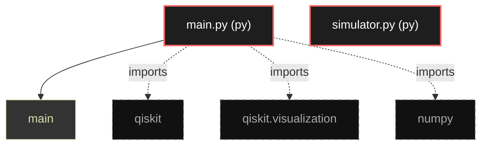

# Polyglot Codebase Knowledge Graph

> Generated offline by **readmenator**. Supports C, C++, Python, Go, Rust, JS/TS, Java, C#, Shell, PHP, Dart, GDScript, Nim, ASM.
> No LLMs. No tokens. Pure static analysis.

**Total Files Parsed:** 2 | **Total Symbols Extracted:** 1 | **Total Imports:** 3

## Structural Knowledge Map

---

## Architecture Reference

### PY (2 files)

#### `main.py`
**Path:** `main.py`

**Functions:**
- `main` (line 5)

#### `simulator.py`
**Path:** `simulator.py`

*No symbols extracted*
